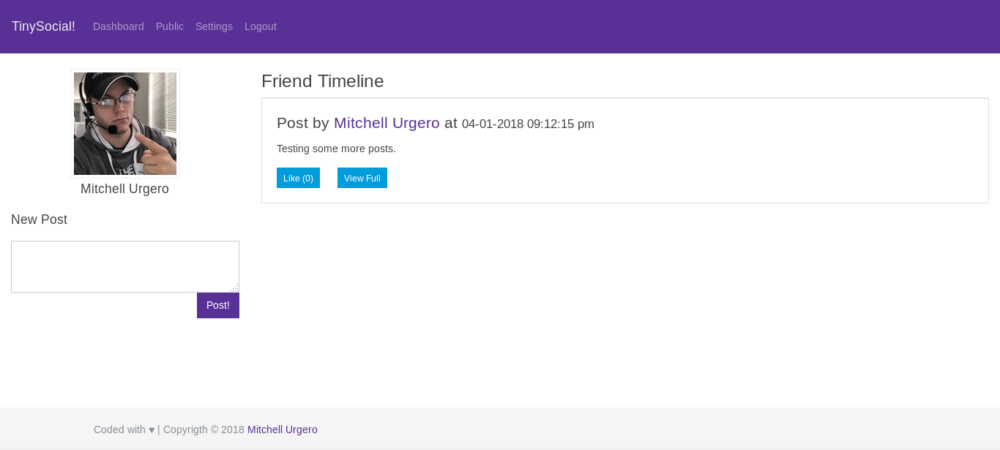

# TinySocial!

The *first* true flat-file backed social network. Complete with a no-nonsense UI.

Being that it is a flat file backed social network, it can run virtually anywhere PHP7 is supported. However, due to many hosting providers "slow" read/write speed this might not be a viable option for you.

Self-hosting (VPS or private in house) is probably the best way to go.

## Features

(Checked boxes signifies the feature is working.)

- [x] Registration (No Captcha yet!)
- [x] Login
- [x] Make a new post
- [ ] Like a post
- [x] Comment on a post
- [x] Add/Remove friends
- [x] Change user settings
- [ ] Plugin Support (Coming soon!)
- [x] Language support (Translations please!!!)

## Installing

**Requirements: php7.0-mbstring php7.0-gd php7.0-mcrypt php7.0-xml**

1. git clone into your directory of choice
2. copy app/config.example.php to config.php
3. edit config.php to suit your needs
4. Test the website to confirm it works.

## Screenshot of beta UI

